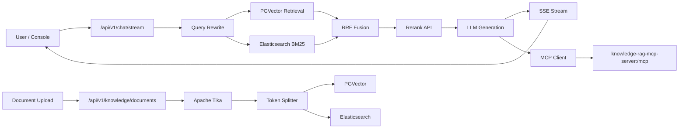

# Knowledge RAG Platform


一个面向企业知识资产场景的初步 RAG 框架，当前版本已经具备文档接入、混合检索、Rerank、流式回答、会话记忆、Prompt 外置和 MCP 工具扩展能力。

项目重点不在“大而全”，而在先把一条可持续演进的企业化骨架搭起来。

## 项目定位

- 面向内部知识库问答、制度库问答、FAQ、文档助手等场景
- 采用 `Spring Boot + Spring AI` 作为应用框架
- 默认使用 `PGVector + Elasticsearch` 组成“向量检索 + 关键词检索”的混合检索链路
- 默认模型供应商为 `SiliconFlow` 兼容 OpenAI 接口
- 通过独立 `MCP Server` 挂载工具能力，便于后续接入企业内部服务

## 当前能力

- 文档接入
  - 支持 `DOC` / `DOCX` / `PDF` / `MD` / `MARKDOWN`
  - 使用 `Apache Tika` 提取正文
  - 使用 `TokenTextSplitter` 进行 Chunk 切分
- 检索增强
  - 查询改写
  - PGVector 相似度检索
  - Elasticsearch BM25 检索
  - RRF 融合
  - 外部 Rerank API 重排
- 生成回答
  - `SseEmitter` 流式输出
  - 会话级 `sessionId`
  - 基于 `MessageWindowChatMemory` 的窗口记忆
  - 新会话自动生成标题
  - 自动生成追问建议
- 工具扩展
  - 通过 `spring-ai-starter-mcp-client` 连接独立 MCP 服务
  - 当前示例工具：天气查询、汇率查询
- 内置前端
  - 主应用启动后直接访问控制台
  - 无需额外前端工程

## 模块划分

### `knowledge-rag-app`

主应用模块，负责：

- HTTP API
- RAG 编排
- 文档入库
- 混合检索
- 流式回答
- Prompt 管理
- 内置控制台

### `knowledge-rag-mcp-server`

工具服务模块，负责：

- 对外暴露 MCP Endpoint
- 提供工具能力示例
- 作为后续接入企业系统的扩展入口

## 当前架构



## 代码结构

主应用采用了初步的企业化分层：

- `interfaces`
  - `rest`
  - Controller 与 DTO
- `application`
  - 业务编排服务
  - 如问答、文档接入、建议生成、Rerank
- `infrastructure`
  - 检索、重排、ES 访问、Query Rewrite、Tool Callback 封装
- `config`
  - Spring Bean 装配与平台配置

目录概览：

```text
knowledge-rag-platform
├── knowledge-rag-app
│   ├── src/main/java/com/nageoffer/ai/knowledgerag
│   │   ├── KnowledgeRagApplication.java
│   │   ├── application/service
│   │   ├── config
│   │   ├── infrastructure/rag
│   │   └── interfaces/rest
│   └── src/main/resources
│       ├── application.yaml
│       ├── prompts
│       └── static/index.html
└── knowledge-rag-mcp-server
    └── src/main/java/com/nageoffer/ai/knowledgerag/mcp
```

## 默认技术栈与运行时组件

- Java `17`
- Spring Boot `4.0.1`
- Spring AI `2.0.0-M2`
- PostgreSQL + PGVector
- Elasticsearch
- Apache Tika `2.9.2`
- SiliconFlow OpenAI 兼容接口

默认模型配置来自 [knowledge-rag-app/src/main/resources/application.yaml](./knowledge-rag-app/src/main/resources/application.yaml)：

- Chat Model: `deepseek-ai/DeepSeek-V3.2`
- Embedding Model: `Qwen/Qwen3-Embedding-8B`
- Rerank Model: `Qwen/Qwen3-Reranker-8B`

## 快速开始

### 1. 环境准备

- JDK 17+
- PostgreSQL，并安装 `pgvector`
- Elasticsearch
- 可用的 `SiliconFlow API Key`

### 2. 环境变量

Linux / macOS:

```bash
export SILICONFLOW_API_KEY=your-real-key
export PGVECTOR_URL=jdbc:postgresql://localhost:5432/knowledge_rag
export PGVECTOR_USERNAME=postgres
export PGVECTOR_PASSWORD=postgres
export ELASTICSEARCH_URL=http://localhost:9200
```

Windows PowerShell:

```powershell
$env:SILICONFLOW_API_KEY="your-real-key"
$env:PGVECTOR_URL="jdbc:postgresql://localhost:5432/knowledge_rag"
$env:PGVECTOR_USERNAME="postgres"
$env:PGVECTOR_PASSWORD="postgres"
$env:ELASTICSEARCH_URL="http://localhost:9200"
```

### 3. 编译

Linux / macOS:

```bash
./mvnw -DskipTests compile
```

Windows:

```powershell
.\mvnw.cmd -DskipTests compile
```

### 4. 启动 MCP 服务

建议先启动工具服务：

```bash
./mvnw -pl knowledge-rag-mcp-server spring-boot:run
```

默认端口：

- `8081`

### 5. 启动主应用

```bash
./mvnw -pl knowledge-rag-app spring-boot:run
```

默认端口：

- `8080`

### 6. 访问控制台

```text
http://localhost:8080/
```

## 配置说明

主配置文件：

- `knowledge-rag-app/src/main/resources/application.yaml`

MCP 服务配置文件：

- `knowledge-rag-mcp-server/src/main/resources/application.yaml`

核心配置前缀：

- `knowledge.rag.rewrite-model`
- `knowledge.rag.answer-model`
- `knowledge.rag.rerank-model`
- `knowledge.rag.rerank-endpoint`
- `knowledge.rag.retrieve-top-k`
- `knowledge.rag.rerank-top-n`
- `knowledge.rag.rerank-max-document-chars`
- `knowledge.rag.chunk-size`
- `knowledge.rag.min-chunk-size-chars`
- `knowledge.rag.min-chunk-length-to-embed`
- `knowledge.rag.max-num-chunks`
- `knowledge.rag.memory-max-messages`
- `knowledge.rag.keyword-top-k`
- `knowledge.rag.rrf-k`
- `knowledge.rag.keyword-analyzer`
- `knowledge.rag.elasticsearch-url`
- `knowledge.rag.keyword-index-name`

与文件上传相关的配置：

- `spring.servlet.multipart.max-file-size`
- `spring.servlet.multipart.max-request-size`

## API 说明

### 1. 上传知识文档

推荐路径：

`POST /api/v1/knowledge/documents`

兼容旧路径：

`POST /api/rag/knowledge/upload`

请求类型：

- `multipart/form-data`

参数：

- `file`：必填
- `kb`：可选，默认值为 `default`

限制：

- 默认最大文件大小 `20MB`

示例：

```bash
curl -X POST "http://localhost:8080/api/v1/knowledge/documents" \
  -F "file=@./docs/employee-handbook.md" \
  -F "kb=hr"
```

返回示例：

```json
{
  "fileName": "employee-handbook.md",
  "kb": "hr",
  "chunkCount": 12
}
```

### 2. 流式问答

推荐路径：

`POST /api/v1/chat/stream`

兼容旧路径：

`POST /api/rag/chat/stream`

请求类型：

- `application/json`

示例：

```bash
curl -N -X POST "http://localhost:8080/api/v1/chat/stream" \
  -H "Content-Type: application/json" \
  -d "{\"question\":\"年假最多可以累计多少天？\",\"kb\":\"hr\"}"
```

请求体：

```json
{
  "question": "年假最多可以累计多少天？",
  "kb": "hr",
  "sessionId": null
}
```

SSE 事件：

- `meta`
  - 返回 `sessionId`
- `title`
  - 新会话标题
- `token`
  - 模型流式输出 token
- `sources`
  - 命中文档来源与分片数量
- `suggestions`
  - 推荐追问，或 fallback 文本
- `done`
  - 结束标记
- `error`
  - 错误信息

## Prompt 模板

Prompt 已全部外置，便于独立调优：

- `prompts/rewrite-system.st`
- `prompts/rewrite-user.st`
- `prompts/answer-system.st`
- `prompts/answer-user.st`
- `prompts/title-system.st`
- `prompts/title-user.st`
- `prompts/suggestions-system.st`
- `prompts/suggestions-user.st`

对应位置：

- `knowledge-rag-app/src/main/resources/prompts`

## MCP 工具说明

当前 MCP 服务内置两个示例工具：

- `queryWeatherForecast`
  - 返回模拟天气数据
- `queryExchangeRate`
  - 返回内置汇率表换算结果

这两个工具目前都是演示实现，不应直接视为生产级实时数据源。

## 当前实现边界

- `domain` 层尚未拆分，当前仍以 `application + infrastructure` 为主
- 会话记忆目前使用内存实现，尚未持久化
- MCP 工具为示例能力，不是正式企业集成
- 测试目录中保留了若干实验性质 Demo，用于模型、检索、Prompt 验证
- 权限模型、多租户隔离、审计和可观测性尚未落地

## 后续演进建议

- 引入 `domain` 层和明确的领域契约
- 接入 IAM、租户隔离、知识库权限与操作审计
- 增加离线评测、回归测试、Trace 和指标采集
- 增加文档元数据治理、标签、版本与生命周期管理
- 将 MCP 示例工具替换为真实企业系统接口
- 拆分知识库、检索、会话、工具调用等子模块

## License

Apache License 2.0
